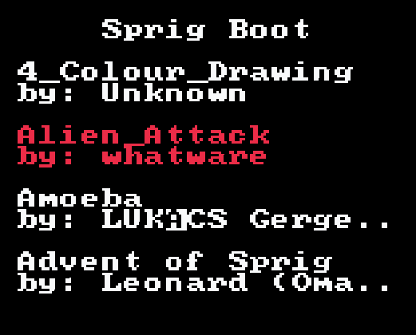

# Sprig Boot 🥾

Since the day I got my [sprig](https://sprig.hackclub.com),
I've always wanted to wanted to load **every** game onto the little thing at once.
Unfortunately, with the stock firmware, that's not possible.
However, using some javascript trickery, we can get close!

Sprig Boot gives you a pretty menu to boot multiple sprig games with!
How many?
Well, it can hold roughly 200kb of games.

[Try it out for yourself and enjoy!](https://davnotdev.github.io/sprig-boot/)

## Your 🥾-er is Ugly

Yes, that's true!
Feel free to modify the bootloader code [here](lib/game.js) and send a PR.

